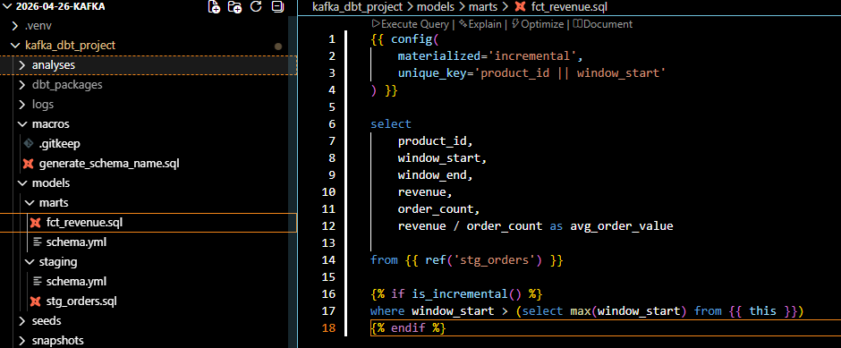
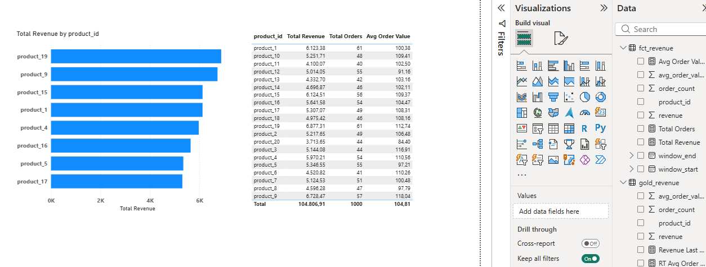

# Kafka Real-Time E-Commerce Analytics Pipeline

An end-to-end real-time analytics project built with Kafka, Spark, Databricks, dbt, and Power BI.

This project simulates real-time e-commerce order events, processes streaming data through a modern lakehouse architecture, and visualizes operational and analytical insights in Power BI.

---

# Architecture

```text id="jwjlwm"
Python Producer
      ↓
Confluent Cloud Kafka
      ↓
Databricks Spark Processing
      ↓
Delta Gold Table
      ↓
dbt Incremental Mart
      ↓
Power BI Dashboard
```

---

# Tech Stack

| Layer                | Technology              |
| -------------------- | ----------------------- |
| Event Streaming      | Kafka (Confluent Cloud) |
| Data Producer        | Python                  |
| Stream Processing    | Apache Spark            |
| Lakehouse            | Databricks Delta        |
| Transformation Layer | dbt                     |
| Visualization        | Power BI                |
| Package Management   | uv                      |
| Version Control      | Git + GitHub            |

---

# Project Goal

The goal of this project is to demonstrate a modern real-time analytics architecture using event-driven data engineering principles.

The pipeline simulates e-commerce orders in real time, processes them with Spark, stores curated analytics tables in Delta Lake, transforms them through dbt incremental models, and visualizes business KPIs in Power BI.

---

# Features

* Real-time order event simulation
* Kafka cloud-based streaming ingestion
* Spark-based event aggregation
* Delta Lake gold-layer analytics tables
* dbt incremental transformation models
* Power BI dashboard integration
* Top product revenue analysis
* Revenue and order aggregation
* Near real-time analytics architecture

---

# 1. Python Kafka Producer

The producer generates synthetic e-commerce events and publishes them into Kafka topics.

Example event:

```json id="3yjlwm"
{
  "order_id": "f81d4fae",
  "user_id": "user_12",
  "product_id": "product_5",
  "price": 120.50,
  "quantity": 2,
  "timestamp": "2026-05-16 20:12:11"
}
```

Main technologies:

* confluent-kafka
* python-dotenv

---

# 2. Kafka Streaming Layer

Kafka is hosted on Confluent Cloud.

Topic used:

```text id="jlwmt8"
orders
```

The producer continuously sends JSON events into the topic.

---

# 3. Spark Processing in Databricks

Spark reads Kafka messages, parses JSON payloads, and aggregates data into minute-level analytical windows.

Main transformations:

* JSON parsing
* Event-time conversion
* Window aggregation
* Revenue calculation
* Order count aggregation
* Average order value calculation

Aggregation granularity:

* 1-minute windows
* Product-level aggregation

---

# 4. Delta Gold Layer

Processed results are stored as Delta tables inside Databricks.

Gold table:

```text id="jlwmvb"
Kafka1.default.gold_revenue
```

The table contains:

* product_id
* revenue
* order_count
* avg_order_value
* window_start
* window_end

This layer represents near real-time operational analytics.

---

# 5. dbt Incremental Models

dbt is used to create analytical marts on top of the Gold layer.

Implemented concepts:

* incremental loading
* staging layer
* fact table modeling
* reusable transformations

Main model:

```text id="jlwm1x"
fct_revenue
```

Incremental logic:

```sql id="jlwm67"

where window_start > (
    select max(window_start)
    from {{ this }}
)

```

This allows dbt to process only newly arrived data instead of rebuilding the entire table.

---

# 6. Power BI Dashboard

The dashboard combines:

* near real-time operational metrics
* historical aggregated analytics

Visualizations include:

* Top products by revenue
* Revenue aggregation
* Order count aggregation
* Average order value
* Product-level performance analysis

---

# Screenshots

## dbt Incremental Load



## Power BI Dashboard




---

# Key Learnings

This project demonstrates:

* event-driven architecture
* streaming analytics
* Spark aggregation patterns
* Delta Lake usage
* dbt incremental modeling
* real-time BI integration
* modern data engineering workflows

---

# Future Improvements

Potential next steps:

* real streaming jobs with structured streaming clusters
* Airflow orchestration
* CI/CD deployment
* Kafka schema registry
* Medallion architecture expansion
* real-time alerting
* Dockerized local environment
* cloud deployment automation

---

# Author

Ozgur Kocak

Data Analytics & Analytics Engineering Projects

